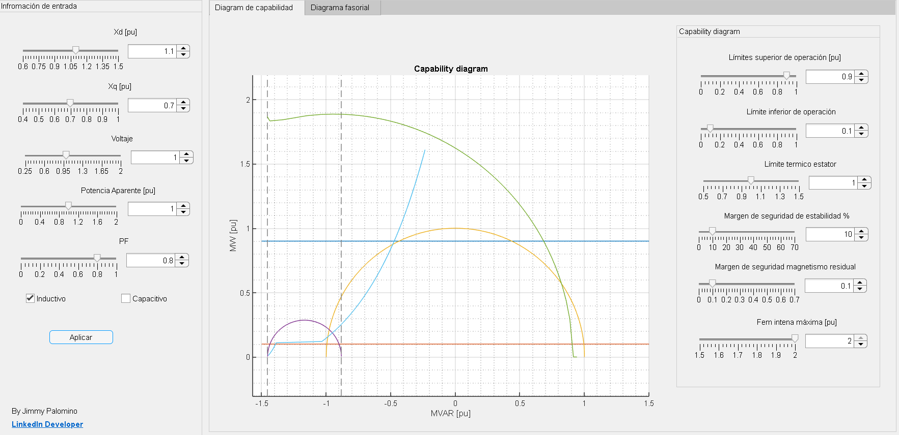
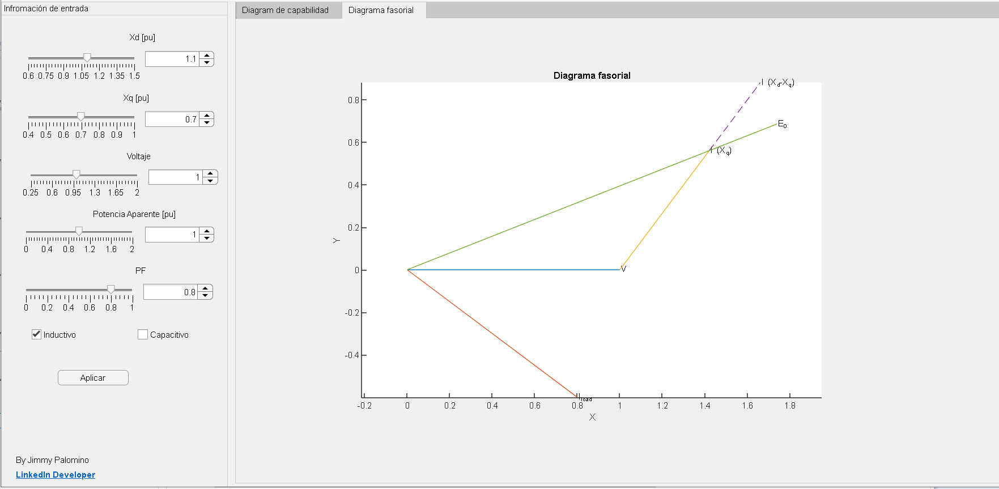

# CapabilityApp
By: [Jimmy Palomino](https://www.linkedin.com/in/jimmypalomino/, 'LinkedIn')

## Description
This application draws the capacity diagram for a salient pole synchronous machine.

To run click on `Aplicar`

### Capability Diagram 

## Phasor Diagram

## Objetive 
Generate the capability diagram for a salient pole synchronous machine based in a intuitive app.

## Requirements
MatLab > 2021a

## Files

### CapabilityAppDesigner 
Contains the AppDesigner file, this can be opened by:
* Typing `appdesigner` in the MatLab console.
* From the AppDesigner interface, open this file.

### CapabilityMatLab
Contains the '.m' file to use this file ony run.

## References 

This work is based on: 

da Costa Junior, Pedro & Goncalves Junior, Luiz & Aquino, Claudio & Souza, André & Castanho, Jose Eduardo. (2010). CONSTRUÇÃO DE CURVAS DE CAPACIDADE DE GERADORES SÍNCRONOS USANDO MATLAB. 

Avaliable in: [Research Gateway](https://www.researchgate.net/publication/268292252_CONSTRUCAO_DE_CURVAS_DE_CAPACIDADE_DE_GERADORES_SINCRONOS_USANDO_MATLAB)

## Developer

Jimmy Palomino 
[LinkedIn](https://www.linkedin.com/in/jimmypalomino/)
